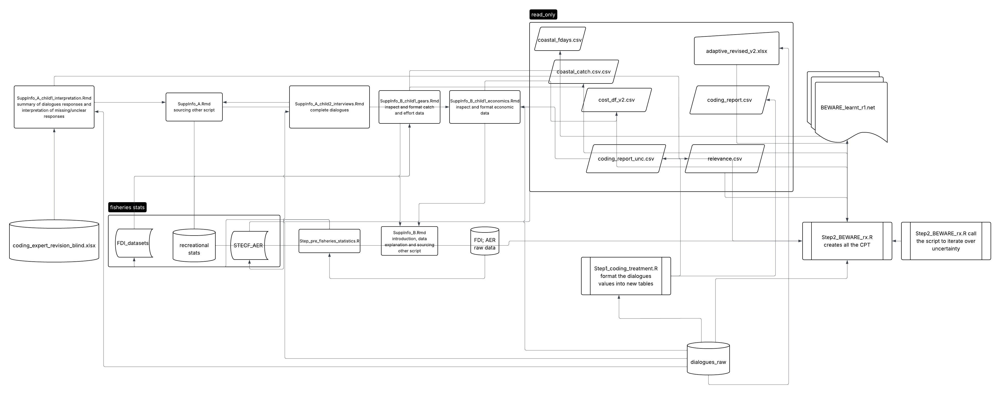
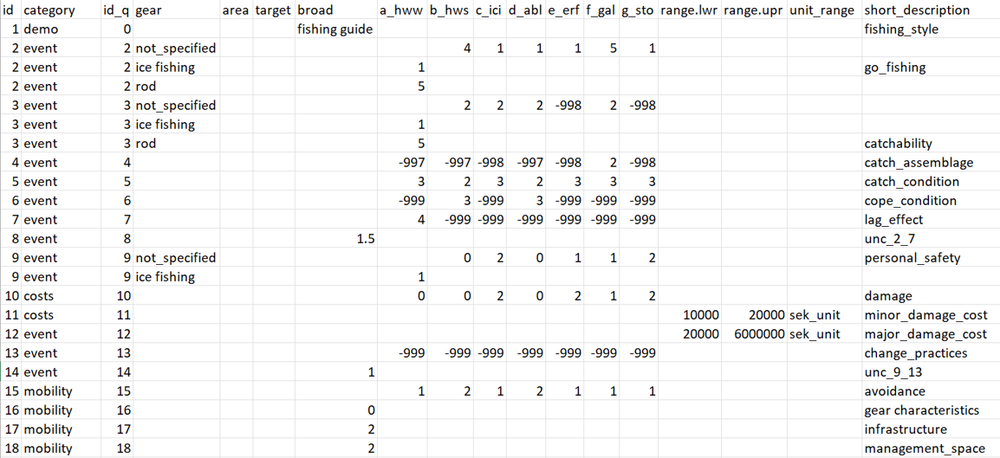

# Introduction

# Folder overview

## Code

```{r, include=T, echo=FALSE, fig.width = 10, fig.height=5, fig.pos='H', message=FALSE, warning=FALSE}
printtree::print_rtree("C:/github/extreme_weather_risk/code")
```

-   Step_pre_fisheries_statistics.R: format large open source datasets into smaller .csv files #not run

-   Step1_coding_treatments.R: format expert scores into a tidy file

-   Step2_BEWARE_r1_0_0.R: handle all the conditional probability distributions and save a trained model

-   Step2b_iterBN.R: iterates the script Step2_BEWARE_r1_0_0.R activating random samples and saving n trained models

-   Step3_scenarios.R: test scenarios by setting evidences in decision nodes of the model produced by Step2_BEWARE_r1_0_0.R

-   Step3b_iter_scenarios.R: test scenarios over the iterated n trained models produced by Step2b_iterBN.R

-   supporting_r1.R: includes several custom functions

## Data

```{r, include=T, echo=FALSE, fig.width = 10, fig.height=5, fig.pos='H', message=FALSE, warning=FALSE}
printtree::print_rtree("C:/github/extreme_weather_risk/data")
```

-   editable_files: contain all the files where the user can input values

    -   networks: stores the BN templates
        -   BEWARE_release_v1_0_0.net: BN template in .net format, layout NOT supported by GeNIe
        -   BEWARE_release_v1_0_0.xdsl: BN template in .xdsl format, with layout supported by GeNIe
    -   adaptive_revised_v2.csv: file indicating which answer refers to an adaptive strategy
    -   coding_expert_revision_blind.xlsx \# revision of unclear answers
    -   dialogues_raw.xlsx
    -   nodes_text.xlsx
    -   questionnaires_coded.xlsx

-   fisheries_statistics: files described in Supplementary Information B (docs folder)

-   read_only: files automatically generated that does not need to be modified

## Docs

```{r, include=T, echo=FALSE, fig.width = 10, fig.height=5, fig.pos='H', message=FALSE, warning=FALSE}
printtree::print_rtree("C:/github/extreme_weather_risk/docs")
```

# Workflow overview

{width="741"}

# Include observations

The dataset questionnaires_coded.xlsx (Figure 2) is where all the dialogues answers are manually inserted. The dialogue text is reported in SuppInfo A (docs folder).

The fields that describes the answer metadata are:

-   id:

-   category

-   id_q

-   gear

-   area

-   target

-   short_description

The other fields are used to report dialogues results. There are three type of questions:

-   by event (e.g.: id_q 2-7): one value is expected for each event and it is reported in the columns a_hww; b_hws; c_ici; d_abl; e_erf; f_gal; g_sto according to the event

-   one single value (e.g.: id_q16-18): the value is reported in the column *broad*

-   one value with uncertainty (e.g.: id_q 11-12): the lower and upper range are included in the columns range.lwr and range.upr, the unit in unit_range



# Generate CPT

# Scenarios
