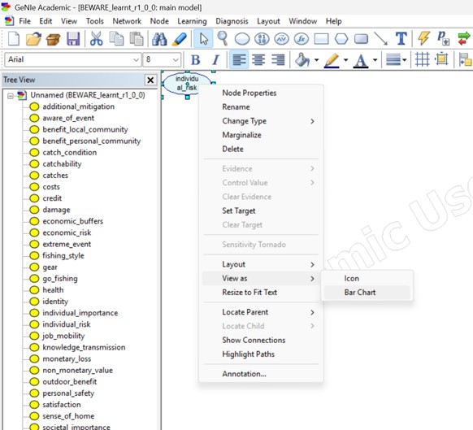
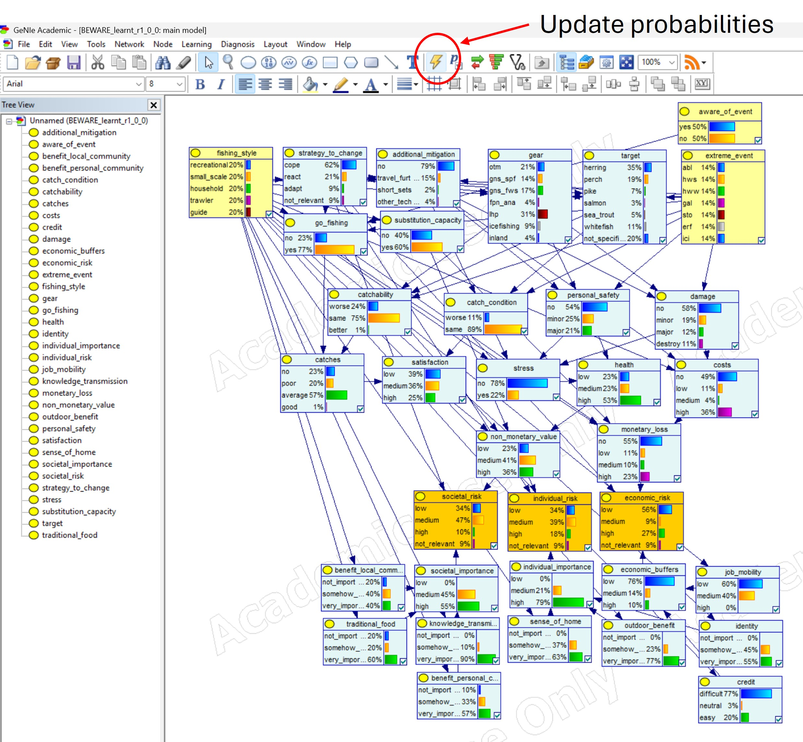
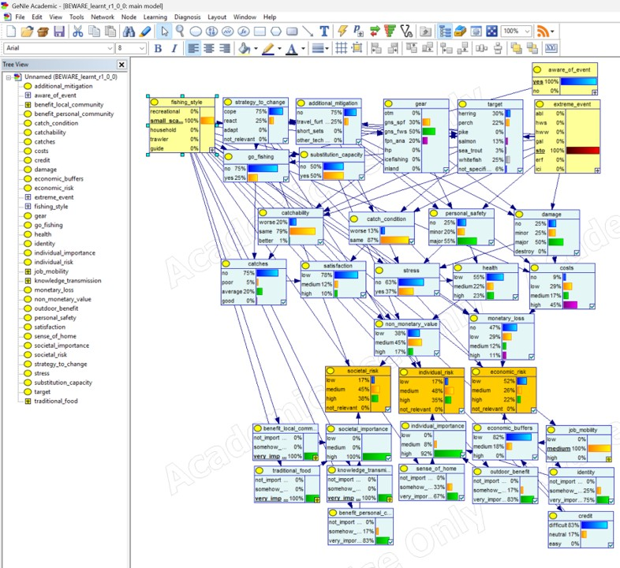
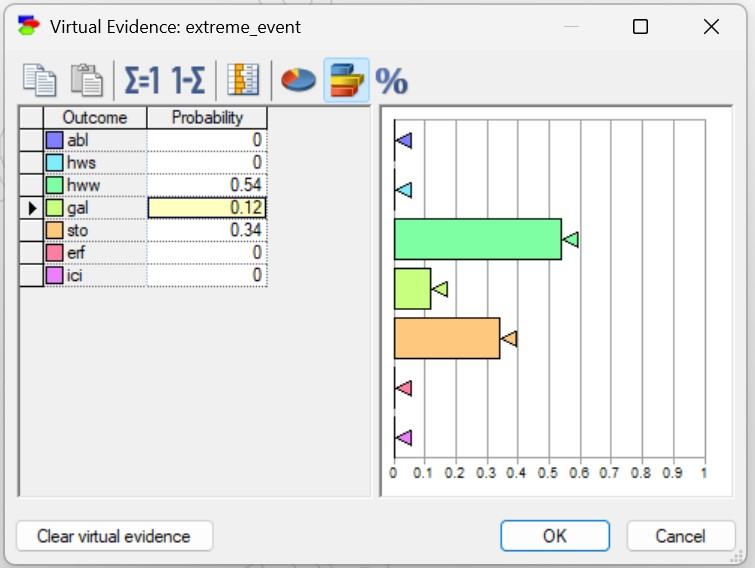
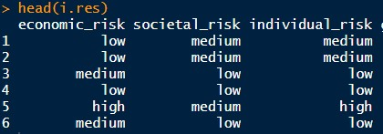

# BEWARE: a Bayesian Extreme WeAtheR Event model for fishing operations

[](https://github.com/mhucka/readmine/releases) [](https://zenodo.org)

## Table of contents

-   [Introduction](#introduction)
-   [Quick start](#quick-start)
-   [Usage (GeNIe GUI)](#usage_1)
-   [Usage (bnlearn)](#usage_2)
-   [Contributing](#contributing)
-   [Getting help](#getting-help)
-   [Acknowledgments](#acknowledgments)

## Introduction {#introduction}

Welcome to BEWARE repository. BEWARE is a Bayesian Network model for risk analysis regarding the effects of extreme weather events on fisheries. The model has been developed in a participatory approach with commercial and recreational Swedish fishers. The model description is provided in DOI.

## Quick start {#quick-start}

BEWARE is released as .net file and is compatible with several softwares for Bayesian Network modeling. The model is available under data/read_only/networks/BEWARE_learnt_r1_0_0_0.net. We have been using GeNIe Modeler (REF), a Graphical User Interface available as free software for academic research purposes (<https://download.bayesfusion.com/files.html?category=Academia>).

Once you have GeNIe installed, you can just open the BEWARE.net file, adjust visualization settings in the software, and you are ready to explore the risks.

### Adjusting visualisation

The .net file format does not support visualisation rules to be interpreted by GeNIe software. When you import the .net file for the first time all nodes are shown as plain icons and are stacked on top of each other.\
We recommend: - to change visualization to Bar Chart. This is done by dragging a selection box around the icons, then right-click on the first icon on the pile. A side menu (Figure 1) would appear. Navigate on the *view as* option, then select *Bar Chart*. - to display the nodes in your available screen space by dragging them. You can eventually change color backgrounds. Our preferred option is shown in Figure 2.

{width="400"}

## Usage (GeNIe GUI) {#usage_1}

After setting up the model model available at data/read_only/networks/BEWARE_learnt_r1_0_0_0.net in the GeNIe software as explained in the [Quick start](#quick-start) section, BEWARE is ready to be used for visualising the probability distributions. This type of utilisation is recommended for education and results dissemination. For more complex analysis we recommend to handle the software in R environment as explained in the [Usage (bnlearn)](#usage_2) section.

### Setting decision nodes and update the probability distribution

Probabilities distributions are updated by clicking on the "flashing light" icon as shown in Figure 2. A simple update would show the probability distribution in absence of any evidence. This imply that all the levels of the decision nodes (colored in yellow in Figure 2) have equal probability. To include evidences there are two options: (1) left-click on one level of the decision node to select it with 100% probability (Figure), (2) using the virtual evidence panel (Figure) to set the probabilities for multiple levels. The virtual probability panel is accessible by right-clicking on a decision node. Once the evidences are included, right click again on the "update" icon.

{width="350"}

{width="350"}

{width="300"}

## Usage (bnlearn)

In our research we handled the BEWARE model with the bnlearn R package. Functions from this package were also used to set up the conditional probability tables, ax explained in the SECTION. To start handling BEWARE in R, install the bnlearn package and, for some extra visualisation functions, we also recommend to install the Rgraphviz package.

``` R
install.packages('bnlearn')
install.packages('Rgraphviz')
```

The model can be imported with the `read.net` function and visualized with `graphviz.plot`

``` R
remove(list=ls())
scriptPath <- rstudioapi::getSourceEditorContext()$path
scriptDir <- dirname(scriptPath)
setwd(file.path(scriptDir, '..')) 
library(Rgraphviz)
library(bnlearn)
theme_set(theme_bw())
net=read.net('data/read_only/networks/BEWARE_learnt_r1_0_0.net', debug = T)
graphviz.plot(net, layout = "dot", fontsize = 18)
```

### Setting decision nodes and update the probability distribution

Evidence can be set by implementing conditional probability queries. We used the `cpdist` function, which generates random samples conditional on the evidence using the method specified in the method argument. Arguments of the `cpdist` function are:

fitted: an object of class bn.fit. nodes: a vector of character strings, the labels of the nodes whose conditional distribution we are interested in. evidence: named list, where each element corresponds to one node in the network and must contain the value that node will be set to when sampling n: a positive integer number, the number of random samples to generate from fitted. method: a character string, the method used to perform the conditional probability query. Currently only logic sampling (ls, the default) and likelihood weighting (lw) are implemented.

``` R
i.res=cpdist(fitted = net, 
        nodes = c('economic_risk', 'societal_risk','individual_risk'), 
        evidence = list(extreme_event = 'hws', aware_of_event='yes'), 
        n=10^5, 
        method='lw')
```
The output of `cpdist` is a dataframe of *n* rows, each including draws for the nodes requested

{width="300"}


## Including your own data

If you want to use the software for your own case study you need to be able to include you own data. The [`GUIDELINES`](GUIDELINES.pdf) section provide more detailed guidelines on the procedure we used to geenrate the conditional probabilties distribution, and explains how and where to include your own data. 

## Getting help {#getting-help}

For any issue feel free to reach out enrico.e.armelloni@gmail.com


## Acknowledgments {#acknowledgments}

The content of this repository was realised within the project [Marine extreme weather: ecological effects and risks to fisheries](https://www.slu.se/en/research/research-catalogue/projekt/m/marina-varmeboljor-och-extremvader-effekter-pa-fiskade-ekosystem-och-risker-for-fiske/), funded by the [FORMAS](https://formas.se/en/start-page.html) funding plan of the Swedish government.

This README has been inspired by  [READMINE: Suggested template for software READMEs](https://github.com/mhucka/readmine/tree/main)

